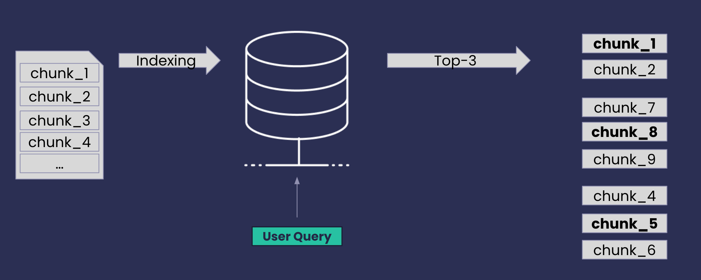
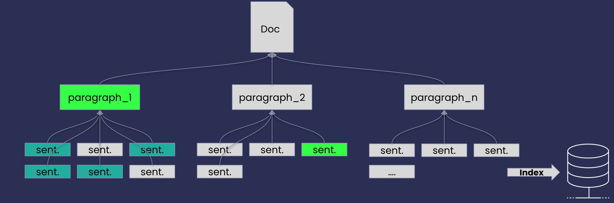
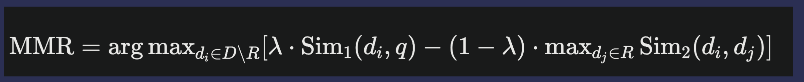
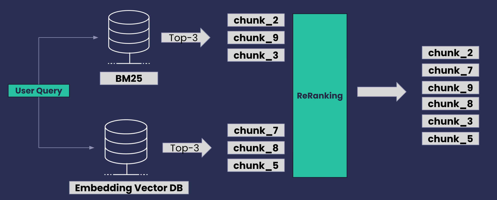
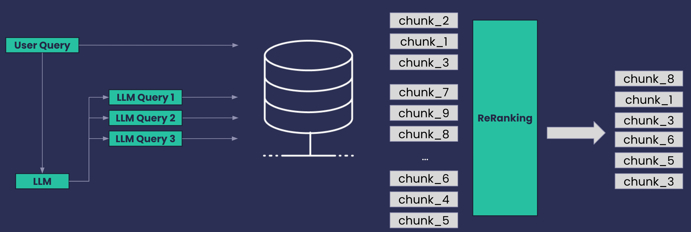
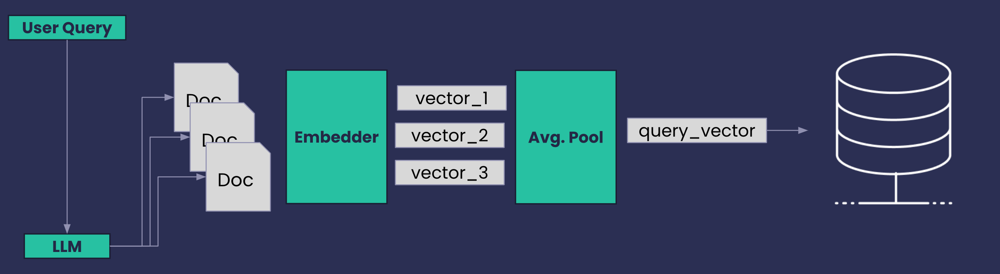
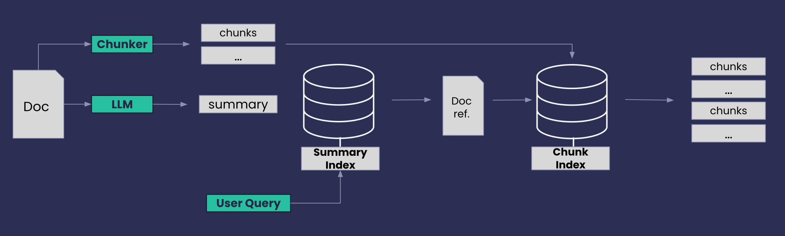
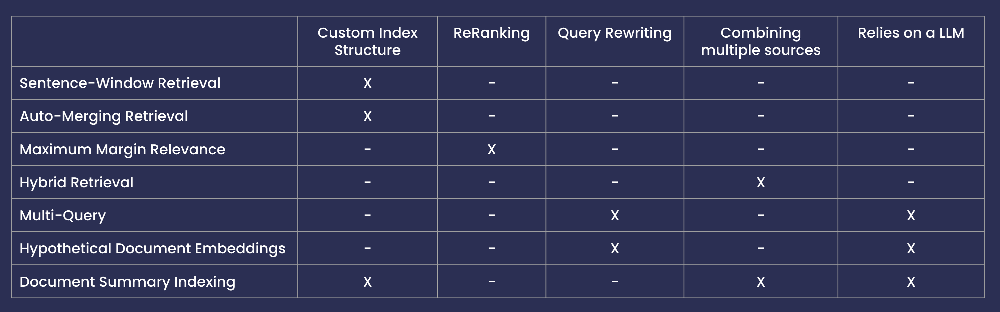

# Retrieving with Haystack 2.x

This repository contains showcases different retrieval techniques within the context of a RAG-based QA system.
The retrieval techniques are implemented using the [Haystack 2.x](https://github,com/deepset-ai/haystack) library and 
evaluated using the [ARAGOG dataset](https://github.com/predlico/ARAGOG) with the Semantic Similarity metric.  This was part of a presentation given at the Open NLP Meetup #14: on 2024-11-28 hold at [deepset](https://deepset.ai) in Berlin.

- [Presentation Slides](2025_04_PyConLit.pdf)
<!-- - [YouTube video recording](https://www.youtube.com/watch?v=_XntQls_j1A)-->

### Retrieval Techniques 

1. [Sentence Window Retrieval](#sentence-window-retrieval)
2. [Auto-Merging Retrieval](#auto-merging-retrieval)
3. [Maximum Marginal Relevance](#maximum-marginal-relevance)
4. [Hybrid Search Retrieval](#hybrid-search-retrieval)
5. [Multi-Query](#multi-query)
6. [Hypothetical Document Embeddings - HyDE](#hypothetical-document-embeddings---hyde)
7. [Document Summary Index](#document-summary-index)

---

## Sentence Window Retrieval

The sentence window retrieval technique that allows for the retrieval of the context around relevant sentences.
During indexing, documents are broken into smaller chunks or sentences and indexed. During retrieval, the sentences most relevant to a given query, based on a certain similarity metric, are retrieved.
Once we have the relevant sentences, we can retrieve neighboring sentences to provide full context. The number of neighboring sentences to retrieve is defined by a fixed number of sentences before and after the relevant sentence.

## Auto-Merging Retrieval

Auto-Merging is a retrieval technique that leverages a hierarchical document structure. Where we can think of the smaller 
documents as the children of the original document and the original document as the parent. This results in a 
hierarchical tree structure where each smaller document is a child of a previous larger document. The retrieval process
starts by retrieving the most relevant leaf nodes (smallest documents) and then deciding whether to return them or the 
parent depending on whether the number of matched leaf nodes below the same parent is above a certain threshold.

## Maximum Marginal Relevance

Maximum Marginal Relevance ranks documents by selecting first those relevant to the query and dissimilar to the 
already retrieved. [[1](#1)] This technique is used to re-rank the documents retrieved by the baseline RAG model.
It aims to balance the trade-off between relevance and diversity, going towards the objective that a document should be 
relevant to the user's query and have minimal similarity to previously selected documents.

## Hybrid Search Retrieval

Hybrid Search Retrieval combines multiple retrieval strategies, One example of hybrid search is combining keyword search 
with semantic search, for instance, a BM25 retrieval and a embeddings-based retrieval. One example of where hybrid
search is useful can be seen in platforms like e-commerce websites. Users might either specific product names or features 
(handled well by keyword search) but also describe what they are looking for in broader terms (better suited for semantic search). 

## Multi-Query
 

Multi-query retrieves documents based on multiple queries generated from the original query by using synonyms, different
word orders, or other transformations. This technique is used to retrieve documents that might not be retrieved by the
original query but are relevant to the user's information need. Another possibility of multi-query is by breaking down 
the original query into multiple sub-queries. This technique is useful when the original query is too broad or ambiguous, 
and the retrieval system can benefit from multiple interpretations of the query.

## Hypothetical Document Embeddings - HyDE

Given a query, the Hypothetical Document Embeddings (HyDE)[[2](#2)] first zero-shot prompts an instruction-following language model 
to generate a “fake” hypothetical document that captures relevant textual patterns from the initial query - in practice, 
this is done five times. Then, it encodes each hypothetical document into an embedding vector and averages them. The resulting, 
single embedding can be used to identify a neighbourhood in the document embedding space from which similar actual 
documents are retrieved based on vector similarity.

## Document Summary Index

Document Summary Index leverages document summaries for retrieval and uses full text documents for response generation. [[3](#3)]
It is a two-step retrieval process. First, the document summaries are indexed. Then, the full text documents are indexed
into chunks. The document summaries are used to retrieve the full text documents. This technique is used to improve the retrieval
performance of the RAG model by using the document summaries to retrieve the full text documents.

# Summary

# Experimental Results

The following table shows the semantic similarity of the answers retrieved by the different techniques over the [ARAGOG 
dataset](https://github.com/predlico/ARAGOG). The results are obtained by comparing the retrieved answers with the ground truth answers using the Semantic
Similarity metric.

| Technique                                 | Semantic Answer Similarity |
|-------------------------------------------|----------------------------|
| Sentence-Window Retrieval                 | 0.700                      |
| Auto-Merging Retrieval                    | 0.505                      |
| Baseline RAG + Maximum Marginal Relevance | 0.670                      |
| Hybrid Search                             | 0.699                      |
| Multi-Query                               | 0.620                      |
| Hypothetical Document Embeddings - HyDE   | 0.693                      |
| Document Summary Index                    | 0.731                      |

## References

1. [The Use of MMR, Diversity-Based Reranking for Reordering Documents and Producing Summaries](https://www.cs.cmu.edu/~jgc/publication/The_Use_MMR_Diversity_Based_LTMIR_1998.pdf)
2. [Hypothetical Document Embeddings - HyDE](https://aclanthology.org/2023.acl-long.99/)
3. [A New Document Summary Index for LLM-Powered QA Systems](https://www.llamaindex.ai/blog/a-new-document-summary-index-for-llm-powered-qa-systems-9a32ece2f9ec)
